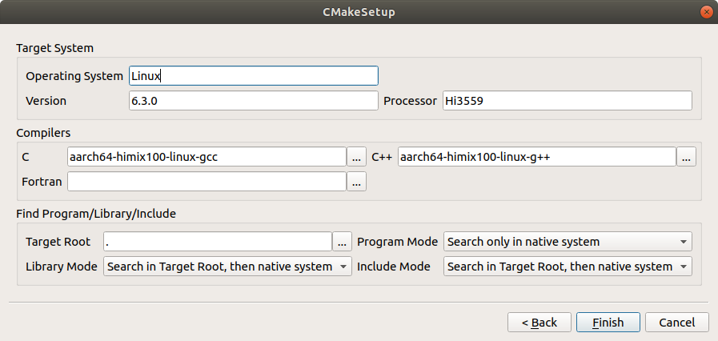

# Setup OpenCV on Hi3559A

1. To cross compile opencv, you need to compile zlib first and copy library of zlib to aarch tool chain files, e.g. `include\`, `lib`.

2. Open cmake-gui, after clicked *'Configure'*, choose last item *(specify options for cross-compiling)* and modify as following:



After you have clicked *'Finish'*, you can modify the settings as it is set on Ubuntu.

3. During compilation, if it reports *undefined reference to 'png_init_filter_functions_neon'*, modify `opencv/3rdparty/libpng/pngpriv.h`
as following:

```c++
 130| /*#  if (defined(__ARM_NEON__) || defined(__ARM_NEON)) && \*/
 131| #   if defined(PNG_ARM_NEON) && (defined(__ARM_NEON__) || defined(__ARM_NEON)) && \
```

4. After compilation and installation, do not use libs from installed path, instead, copy files in `opencv/build/lib` to `install/path/lib` and replace origin files.
